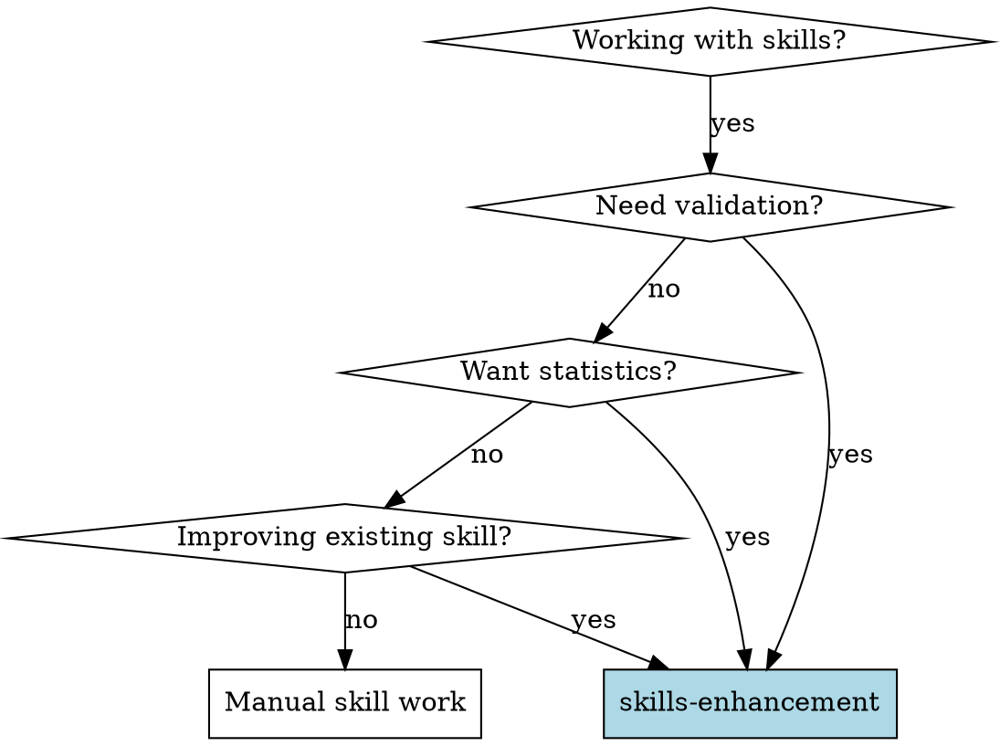
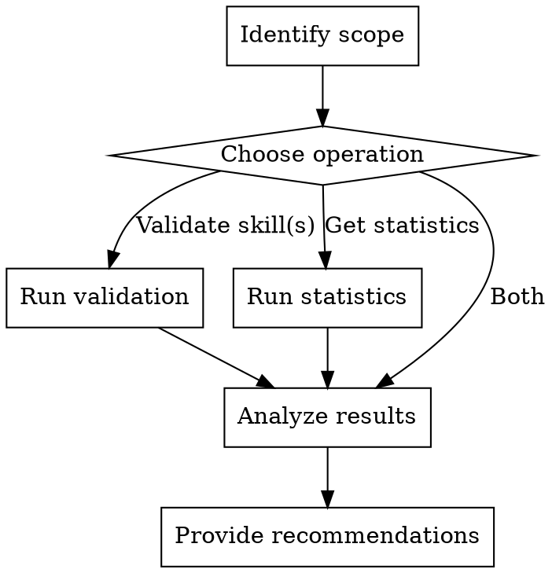

# Skills Enhancement

Analyze and improve skills using the skills-stats and skills-validator utilities.

**Core principle:** Data-driven skill improvement through validation, statistics, and quality analysis

## When to Use



**Use when:**
- Validating new or existing skills
- Analyzing skill composition and statistics
- Reviewing skill quality before publishing
- Finding gaps in skill coverage
- Comparing skills across categories
- Generating skill reports

## The Process



## Operations

### 1. Validate Single Skill

```javascript
import { validateSkill, formatValidationResult } from '../lib/skills-validator.js';

const skillPath = 'skills/my-skill';
const result = validateSkill(skillPath);

console.log(formatValidationResult(result, skillPath));

// Check result
if (!result.valid) {
    // Report errors that must be fixed
    result.errors.forEach(err => console.error(`❌ ${err}`));
}

if (result.warnings.length > 0) {
    // Report recommended improvements
    result.warnings.forEach(warn => console.warn(`⚠️ ${warn}`));
}
```

### 2. Validate All Skills

```javascript
import { validateAllSkills, formatBatchValidationResult } from '../lib/skills-validator.js';

const report = validateAllSkills('skills');
console.log(formatBatchValidationResult(report));

// Programmatic access
const invalidSkills = report.results.filter(r => !r.valid);
invalidSkills.forEach(skill => {
    console.log(`${skill.skillName}: ${skill.errors.join(', ')}`);
});
```

### 3. Get Skill Statistics

```javascript
import { getSkillsStats } from '../lib/skills-stats.js';

const stats = getSkillsStats('skills');

console.log(`Total skills: ${stats.total}`);
console.log(`Categories: ${Object.keys(stats.byCategory).join(', ')}`);
console.log(`With descriptions: ${stats.withDescription}/${stats.total}`);

// Category breakdown
Object.entries(stats.byCategory).forEach(([cat, count]) => {
    console.log(`  ${cat}: ${count}`);
});

// Newest and oldest
if (stats.newest) {
    console.log(`Newest: ${stats.newest.name} (${stats.newest.modifiedAt})`);
}
if (stats.oldest) {
    console.log(`Oldest: ${stats.oldest.name} (${stats.oldest.modifiedAt})`);
}
```

### 4. Comprehensive Analysis

Combine validation and statistics for complete picture:

```javascript
import { getSkillsStats } from '../lib/skills-stats.js';
import { validateAllSkills, formatBatchValidationResult } from '../lib/skills-validator.js';

// Get overview
const stats = getSkillsStats('skills');
const validation = validateAllSkills('skills');

// Display summary
console.log('=== Skills Enhancement Report ===\n');
console.log(`Total Skills: ${stats.total}`);
console.log(`Categories: ${Object.keys(stats.byCategory).length}`);
console.log(`Valid: ${validation.results.filter(r => r.valid).length}/${stats.total}`);
console.log(`Invalid: ${validation.results.filter(r => !r.valid).length}`);

// Show categories
console.log('\n--- Categories ---');
Object.entries(stats.byCategory)
    .sort((a, b) => b[1] - a[1])
    .forEach(([cat, count]) => {
        console.log(`  ${cat}: ${count}`);
    });

// Show invalid skills
const invalid = validation.results.filter(r => !r.valid);
if (invalid.length > 0) {
    console.log('\n--- Needs Attention ---');
    invalid.forEach(skill => {
        console.log(`\n${skill.skillName}:`);
        skill.errors.forEach(e => console.log(`  - ${e}`));
    });
}

// Show skills without descriptions
if (stats.withoutDescription > 0) {
    console.log('\n--- Missing Descriptions ---');
    stats.skills
        .filter(s => !s.description || s.description.length === 0)
        .forEach(s => console.log(`  - ${s.name}`));
}
```

## Example Workflow

```
User: I want to review all skills and identify any issues

[Use skills-enhancement]

1. Run validation on all skills
   > import { validateAllSkills } from '../lib/skills-validator.js';
   > const report = validateAllSkills('skills');

2. Get statistics for overview
   > import { getSkillsStats } from '../lib/skills-stats.js';
   > const stats = getSkillsStats('skills');

3. Display comprehensive report
   [Shows stats, validation results, recommendations]

4. Identify action items:
   - 2 skills missing descriptions
   - 1 skill has invalid kebab-case name
   - 3 skills have warnings (short descriptions)

5. Provide specific recommendations for each issue
```

## Validation Checks

When validating skills, these checks are performed:

**Critical Errors (must fix):**
- File not found or not readable
- Missing YAML frontmatter
- Missing required fields (name, description)
- Invalid skill name format (not kebab-case)
- Empty description field
- No content after frontmatter

**Warnings (should fix):**
- Description is very short (< 20 chars)
- Skill name doesn't match directory name

## Common Improvement Patterns

### Fix Missing Description

```markdown
---
name: my-skill
description: Use when [condition] - [what it does]  # Add this
---
```

### Fix Invalid Name Format

```
Bad: MySkill, my_skill, MY-SKILL
Good: my-skill
```

### Add Content Section

```markdown
---
name: my-skill
description: Use when X happens - helps you do Y
---

# Skill Name

Add your skill content here...
```

## Red Flags

**Never:**
- Skip validation before publishing skills
- Ignore validation errors (warnings are OK to defer)
- Modify skills without re-validating
- Assume skills are valid without checking

**Always:**
- Validate after making skill changes
- Check for common errors across all skills
- Review warnings as potential improvements
- Use statistics to identify gaps

## Integration

This skill uses:
- **lib/skills-validator.js** - Validation functionality
- **lib/skills-stats.js** - Statistics and analysis

## Quick Reference

| Operation | Function | Output |
|-----------|----------|--------|
| Validate one | `validateSkill(path)` | Validation result |
| Validate all | `validateAllSkills(dir)` | Batch results |
| Get stats | `getSkillsStats(dir)` | Statistics object |
| Format result | `formatValidationResult()` | Human-readable |
| Format batch | `formatBatchValidationResult()` | Summary report |

## Success Criteria

✅ All skills pass validation (no errors)
✅ Skills have meaningful descriptions
✅ Category distribution is balanced
✅ No duplicate or redundant skills
✅ Documentation is up to date
