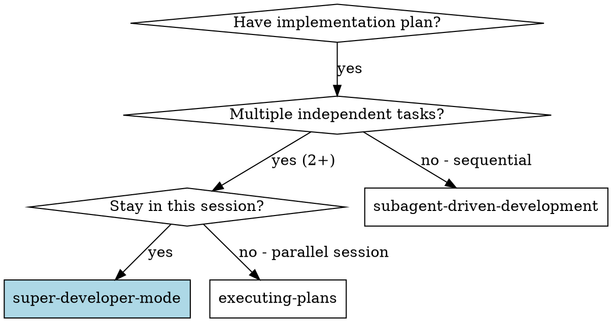
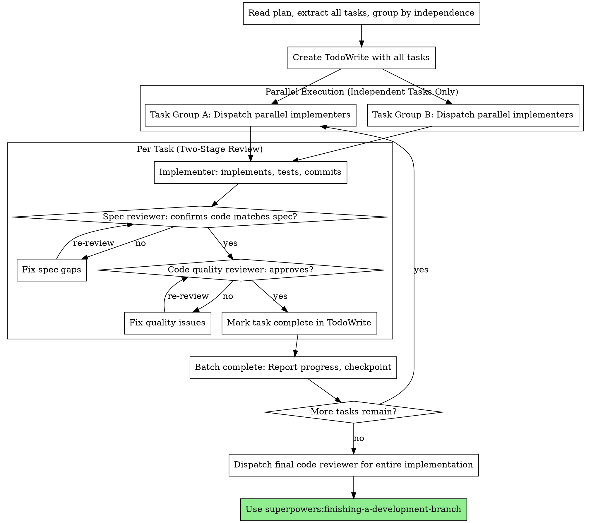

# Super-Developer Mode

Execute complex implementation plans using parallel subagents with two-stage review (spec → quality) and batch checkpoints.

**Core principle:** Parallel subagents + two-stage review + batch checkpoints = maximum speed without sacrificing quality

## When to Use



**Use when:**
- You have a written implementation plan
- 2+ tasks can be executed independently (no shared state/files)
- You want maximum speed with parallel execution
- Quality gates are non-negotiable

**vs. other skills:**
- **vs. subagent-driven-development**: Adds parallel dispatch for independent tasks
- **vs. executing-plans**: Same session (no context switch) + parallel agents
- **vs. dispatching-parallel-agents**: Adds two-stage review quality gates

## The Process



## Step-by-Step

### Phase 1: Plan Analysis

1. **Read the plan file once** - extract all tasks with full text
2. **Group tasks by independence:**
   - Independent: Different files/modules, no shared state
   - Sequential: Must wait for previous tasks
3. **Create TodoWrite** with all tasks

### Phase 2: Parallel Dispatch (Independent Tasks)

**For each group of independent tasks:**

```
Example: 3 independent tasks
Task A: Add user authentication (src/auth/)
Task B: Create rate limiter middleware (src/middleware/)
Task C: Build admin dashboard UI (src/admin/)

All three can run in parallel - no shared files or dependencies!
```

**Dispatch all parallel subagents in a single message:**

```
I'm dispatching 3 parallel subagents to implement independent tasks:

[Subagent 1 prompt - Task A]
[Subagent 2 prompt - Task B]
[Subagent 3 prompt - Task C]
```

### Phase 3: Two-Stage Review (Per Task)

**For EACH completed task:**

```
1. Dispatch spec reviewer subagent
   → Checks: Does code match plan exactly?
   → If no: Implementer fixes, re-review
   → If yes: Proceed to step 2

2. Dispatch code quality reviewer subagent
   → Checks: Is implementation well-built?
   → If no: Implementer fixes, re-review
   → If yes: Mark task complete

IMPORTANT: Do NOT start code quality review until spec compliance is ✅
```

### Phase 4: Batch Checkpoint

After all parallel tasks complete:
- **Report progress:** Show completed tasks + verification output
- **Checkpoint:** Say "Batch complete. Ready for feedback."
- **Wait** for architect review before continuing

### Phase 5: Sequential Tasks

For tasks that must wait for previous work:
- Execute one at a time with full two-stage review
- Same process as subagent-driven-development

### Phase 6: Final Review & Complete

```
1. Dispatch final code reviewer for entire implementation
2. Use superpowers:finishing-a-development-branch
3. Follow that skill for final verification and integration
```

## Subagent Prompt Templates

Use these focused prompts for each subagent type:

**Implementer:**
```markdown
You are implementing Task [N] of the development plan.

TASK: [Paste full task text from plan]
CONTEXT: [Relevant context - where this fits in overall feature]

Your process:
1. Ask clarifying questions if needed
2. Implement following TDD (test-driven-development)
3. Run all verifications specified in plan
4. Self-review your work
5. Commit with descriptive message

Return: Summary of what you implemented and verification results.
```

**Spec Reviewer:**
```markdown
Review Task [N] implementation for SPEC COMPLIANCE.

Original task: [Paste task text]
Commits: [List git commit SHAs to review]

Check:
✅ All requirements implemented?
✅ Nothing extra added?
✅ Nothing missing?
✅ Behavior matches spec exactly?

Return: ✅ Approved or ❌ Issues list
```

**Code Quality Reviewer:**
```markdown
Review Task [N] implementation for CODE QUALITY.

Commits: [List git commit SHAs]

Check:
✅ Clean, readable code?
✅ Good test coverage?
✅ No anti-patterns?
✅ Follows language/framework best practices?

Return: ✅ Approved or ❌ Issues list
```

## Example Workflow

```
You: I'm using Super-Developer Mode to execute this plan.

[Read plan: docs/plans/payment-system.md]
[Extract 7 tasks total]
[Identify independence:
 - Tasks 1-3: Independent (auth, api, db schema)
 - Tasks 4-5: Sequential (depend on 1-3)
 - Tasks 6-7: Independent (docs, monitoring)]
[Create TodoWrite]

=== BATCH 1: Parallel Dispatch ===

I'm dispatching 3 parallel subagents for independent tasks:

[Subagent 1 - Auth Module]
[Subagent 2 - API Endpoints]
[Subagent 3 - Database Schema]

[All three run concurrently...]

Implementer 1: ✅ Auth complete, 5/5 tests passing, committed
Implementer 2: ✅ API complete, 8/8 tests passing, committed
Implementer 3: ✅ Schema complete, migrations tested, committed

=== TWO-STAGE REVIEW (Parallel) ===

[Dispatch 3 spec reviewers in parallel]
Spec 1: ✅ Approved
Spec 2: ❌ Missing: Rate limiting endpoint
Spec 3: ✅ Approved

[Implementer 2 fixes]
Implementer 2: Added rate limiting, 9/9 tests now passing

[Re-review Spec 2]
Spec 2: ✅ Approved

[Dispatch 3 code quality reviewers in parallel]
Quality 1: ✅ Approved
Quality 2: ✅ Approved
Quality 3: ❌ Issue: Migration lacks rollback

[Implementer 3 fixes]
Implementer 3: Added rollback migration

[Re-review Quality 3]
Quality 3: ✅ Approved

=== CHECKPOINT ===

Batch 1 complete:
✅ Task 1: Auth module (5 tests)
✅ Task 2: API endpoints (9 tests)
✅ Task 3: Database schema (with rollback)

Ready for feedback.

[Architect reviews... says "looks good, continue"]

=== BATCH 2: Sequential Tasks ===

[Execute Tasks 4-5 sequentially with full two-stage review]
[These depend on database and API from Batch 1]

...

=== BATCH 3: Parallel Dispatch ===

[Execute Tasks 6-7 in parallel]
[Docs and monitoring are independent]

=== FINAL REVIEW ===

[Dispatch final reviewer for all 7 tasks]
Final reviewer: ✅ All requirements met, ready to integrate

[Use superpowers:finishing-a-development-branch]
Done!
```

## Parallel Dispatch Rules

**✅ Safe to parallelize:**
- Different files/modules
- Different subsystems
- Independent features
- Tests + docs (can run alongside implementation)

**❌ Never parallelize:**
- Tasks sharing files (merge conflicts)
- Sequential dependencies (B needs A's output)
- Shared database tables
- Stateful operations

**When in doubt:** Execute sequentially. The overhead of resolving conflicts exceeds parallel gains.

## Red Flags

**Never:**
- Skip spec compliance review OR code quality review
- Start code quality review before spec compliance passes
- Dispatch parallel tasks that share state/files
- Let implementer "self-approve" (both reviewers required)
- Skip re-review after fixes (reviewer must approve the fix)
- Move to next task with open review issues
- Batch checkpoint without architect review

**Parallel-specific red flags:**
- Don't guess about independence - verify no shared state
- Don't dispatch 5+ agents at once (hard to track)
- Don't mix parallel and sequential in same batch

## Cost Considerations

**More expensive than sequential:**
- Multiple subagents running concurrently
- Two reviewers per task (spec + quality)
- Review loops add iterations

**But faster:**
- 3 tasks in parallel = ~1/3 time
- Early quality gates prevent expensive rework
- Focused subagents work faster than context-switching

**Trade-off:** Higher token cost, faster delivery. Worth it for complex features with independent tasks.

## Advantages Over Individual Skills

**vs. subagent-driven-development (sequential only):**
- Parallel execution for independent tasks
- Significant time savings on complex plans

**vs. executing-plans (parallel session):**
- Same session = no context loss
- Continuous progress visibility
- Faster iteration cycles

**vs. dispatching-parallel-agents (debugging only):**
- Two-stage quality gates
- Plan-based structure
- Systematic execution

## Integration

**Required workflow skills:**
- **superpowers:writing-plans** - Creates the plan
- **superpowers:finishing-a-development-branch** - Complete development

**Subagents should use:**
- **superpowers:test-driven-development** - TDD for each task

## Quick Reference

| Phase | Action | Parallel? |
|-------|--------|-----------|
| **1. Analyze** | Group tasks by independence | - |
| **2. Dispatch** | Implement subagents | ✅ (if independent) |
| **3. Review Spec** | Verify compliance | ✅ |
| **4. Review Quality** | Verify implementation | ✅ |
| **5. Checkpoint** | Report and wait for feedback | - |
| **6. Sequential** | Dependent tasks | ❌ |
| **7. Final** | Full review + finish | - |

## Remember

- **Independence first:** Verify no shared state before parallel dispatch
- **Two-stage review:** Spec compliance → Code quality (never skip or reverse)
- **Re-review required:** Reviewer must approve fixes
- **Batch checkpoints:** Architect review between groups
- **Quality over speed:** Never skip reviews to go faster
