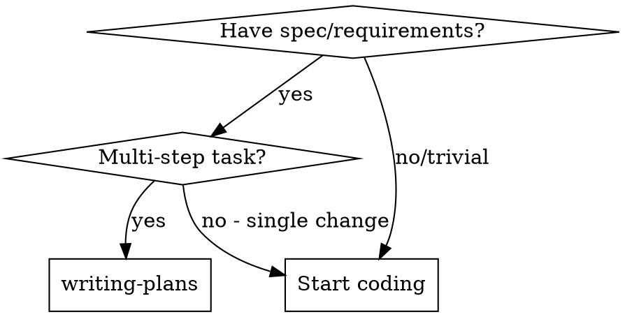

# Writing Plans

## Overview

Write comprehensive implementation plans assuming the engineer has zero context for our codebase and questionable taste. Document everything they need to know: which files to touch for each task, code, testing, docs they might need to check, how to test it. Give them the whole plan as bite-sized tasks. DRY. YAGNI. TDD. Frequent commits.

Assume they are a skilled developer, but know almost nothing about our toolset or problem domain. Assume they don't know good test design very well.

**Core principle:** Zero assumptions - document everything.

**Announce at start:** "I'm using the writing-plans skill to create the implementation plan."

**Context:** This should be run in a dedicated worktree (created by brainstorming skill).

**Save plans to:** `docs/plans/YYYY-MM-DD-<feature-name>.md`

## When to Use



**Use when you see:**
- Requirements/spec for a feature
- Multi-step implementation needed
- Working with subagent who needs context
- Complex task that needs breakdown
- Before ANY code implementation

**Don't use for:**
- Single-line fixes
- Trivial changes
- Emergency hotfixes

## Quick Reference

| Plan Section | Content | Purpose |
|--------------|---------|---------|
| **Goal** | One-sentence objective | What we're building |
| **Architecture** | 2-3 sentences on approach | High-level design |
| **Tech Stack** | Key technologies | Tools/libraries used |
| **Tasks** | Bite-sized steps (2-5 min each) | Implementation guide |
| **Files** | Exact paths for each task | No guessing locations |
| **Code** | Complete examples | No pseudocode |
| **Tests** | Exact test code | TDD verification |
| **Commands** | Full commands with expected output | Verification steps |

## Bite-Sized Task Granularity

**Each step is one action (2-5 minutes):**
- "Write the failing test" - step
- "Run it to make sure it fails" - step
- "Implement the minimal code to make the test pass" - step
- "Run the tests and make sure they pass" - step
- "Commit" - step

## Plan Document Header

**Every plan MUST start with this header:**

```markdown
# [Feature Name] Implementation Plan

> **For Claude:** REQUIRED SUB-SKILL: Use superpowers:executing-plans to implement this plan task-by-task.

**Goal:** [One sentence describing what this builds]

**Architecture:** [2-3 sentences about approach]

**Tech Stack:** [Key technologies/libraries]

---
```

## Task Structure

```markdown
### Task N: [Component Name]

**Files:**
- Create: `exact/path/to/file.py`
- Modify: `exact/path/to/existing.py:123-145`
- Test: `tests/exact/path/to/test.py`

**Step 1: Write the failing test**

```python
def test_specific_behavior():
    result = function(input)
    assert result == expected
```

**Step 2: Run test to verify it fails**

Run: `pytest tests/path/test.py::test_name -v`
Expected: FAIL with "function not defined"

**Step 3: Write minimal implementation**

```python
def function(input):
    return expected
```

**Step 4: Run test to verify it passes**

Run: `pytest tests/path/test.py::test_name -v`
Expected: PASS

**Step 5: Commit**

```bash
git add tests/path/test.py src/path/file.py
git commit -m "feat: add specific feature"
```
```

## Remember
- Exact file paths always
- Complete code in plan (not "add validation")
- Exact commands with expected output
- Reference relevant skills with @ syntax
- DRY, YAGNI, TDD, frequent commits

## Execution Handoff

After saving the plan, offer execution choice:

**"Plan complete and saved to `docs/plans/<filename>.md`. Two execution options:**

**1. Subagent-Driven (this session)** - I dispatch fresh subagent per task, review between tasks, fast iteration

**2. Parallel Session (separate)** - Open new session with executing-plans, batch execution with checkpoints

**Which approach?"**

**If Subagent-Driven chosen:**
- **REQUIRED SUB-SKILL:** Use superpowers:subagent-driven-development
- Stay in this session
- Fresh subagent per task + code review

**If Parallel Session chosen:**
- Guide them to open new session in worktree
- **REQUIRED SUB-SKILL:** New session uses superpowers:executing-plans

## Common Mistakes

**Steps too large**
- **Problem:** "Implement user authentication" (20+ steps hidden)
- **Fix:** Break into "Write test for login", "Run test", "Implement login function", etc.

**Missing context**
- **Problem:** "Update the handler" (which handler? where?)
- **Fix:** "Modify `src/api/handlers.py:145-160` - update response handling"

**Vague instructions**
- **Problem:** "Add validation" (what validation? where?)
- **Fix:** Complete code showing exact validation to add

**Assuming knowledge**
- **Problem:** "Set up the database" (which DB? what schema?)
- **Fix:** Full command with schema SQL file path

**No verification steps**
- **Problem:** Task ends without confirming it works
- **Fix:** Always add "Run: [command], Expected: [output]"

**Skipping edge cases**
- **Problem:** Only happy path in tests
- **Fix:** Add tests for empty inputs, errors, boundaries

## Red Flags

**Never:**
- Write steps that take >5 minutes
- Use pseudocode instead of real code
- Skip file paths (assume "they'll find it")
- Forget test steps for each task
- Write "add X" without showing what X looks like
- Assume knowledge of project structure
- Skip verification commands

**Always:**
- Break complex steps into smaller ones
- Provide complete, runnable code
- Include exact file paths
- Add test verification for each change
- Show full examples
- Document all dependencies
- Include commands with expected output

## Example: Good vs Bad Plan

### ❌ Bad Plan

```markdown
### Task 1: Set up authentication

Add OAuth login to the app. Use the Auth0 library. Make sure it works with the existing user system.

Files to modify:
- auth.js
- config.js

Test that it works.
```

**Problems:**
- Step too large (should be 5+ steps)
- No exact file paths
- Vague "make sure it works"
- No specific test code
- Assumes Auth0 knowledge

### ✅ Good Plan

```markdown
### Task 1: Add Auth0 authentication library

**Files:**
- Create: `src/auth/auth0.js`
- Modify: `src/config/index.js:45-50`
- Test: `tests/auth/auth0.test.js`

**Step 1: Install Auth0 library**

Run: `npm install --save auth0-js @auth0/auth0-spa-js`
Expected: Package installs successfully

**Step 2: Create Auth0 client**

Create file `src/auth/auth0.js`:

```javascript
import { Auth0Client } from '@auth0/auth0-spa-js';
import config from '../config/index.js';

const auth0Client = new Auth0Client({
  domain: config.auth0.domain,
  client_id: config.auth0.clientId,
  redirect_uri: window.location.origin
});

export default auth0Client;
```

**Step 3: Add Auth0 config to config/index.js**

At line 45, add:

```javascript
auth0: {
  domain: process.env.REACT_APP_AUTH0_DOMAIN,
  clientId: process.env.REACT_APP_AUTH0_CLIENT_ID
}
```

**Step 4: Write test for Auth0 client**

Create `tests/auth/auth0.test.js`:

```javascript
import auth0Client from '../../src/auth/auth0.js';

test('auth0 client is configured', () => {
  expect(auth0Client.domain).toBeDefined();
  expect(auth0Client.client_id).toBeDefined();
});
```

**Step 5: Run test**

Run: `npm test -- tests/auth/auth0.test.js`
Expected: PASS

**Step 6: Commit**

Run: `git add src/auth/auth0.js src/config/index.js tests/auth/auth0.test.js && git commit -m "feat: add Auth0 authentication client"`
```

## Plan Quality Checklist

Before finalizing plan, verify:

- [ ] Every task has exact file paths
- [ ] Code is complete and runnable (not pseudocode)
- [ ] Each step takes 2-5 minutes
- [ ] Verification command with expected output for each task
- [ ] Tests included for all changes
- [ ] Edge cases covered in tests
- [ ] Dependencies documented (which files to check)
- [ ] No assumptions about project knowledge
- [ ] Commits specified for each task
- [ ] Plan follows TDD (test first, then implement)

## Integration

**Used by:**
- **brainstorming** - After design is approved, write implementation plan

**Triggers:**
- **subagent-driven-development** - For this-session execution
- **executing-plans** - For parallel session execution

**References:**
- **superpowers:test-driven-development** - Plan format follows TDD principles
- **superpowers:brainstorming** - Plans come from brainstorming output
